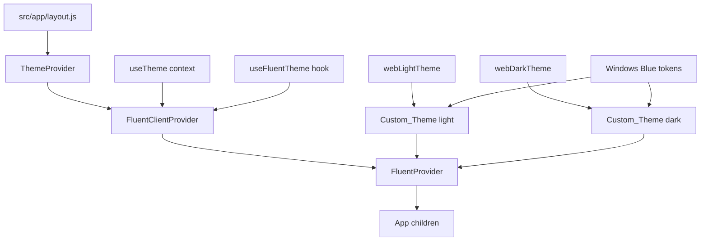

# Design Document: Airi Fluent Design Polish

## Overview

This design covers the migration of the Airi Electron + Next.js desktop app to Microsoft Fluent 2 Design System. The work spans four concerns:

1. **Theme infrastructure** — wrap the app in `FluentProvider` with a Custom_Theme that merges `webLightTheme`/`webDarkTheme` with Windows Blue brand tokens, bridged to the existing Tailwind CSS v4 token layer.
2. **Typography** — load Cabinet Grotesk Extrabold, Satoshi Medium, and Zina via `@font-face` (files already present in `public/fonts/`) and expose them as CSS custom properties and Tailwind theme utilities.
3. **Component migration** — replace inline SVG icons with `@fluentui/react-icons`, replace the custom spinner with Fluent `Spinner`, migrate `SettingsModal` to Fluent `Dialog`, and add a `LogoMark` component using the Zina font.
4. **Responsible AI (RAI) surfaces** — add `RAI_Label`, `RAI_Disclaimer`, `Feedback_Control`, and `Verify_Nudge` to the chat interface.

The existing `ThemeProvider` context (`ui-components/hooks/useTheme.jsx`) is preserved and extended; `FluentProvider` reads from it. Tailwind utility classes are kept but their backing CSS variables are re-pointed to Fluent token values, avoiding a full class rewrite.

---

## Architecture



`FluentProvider` must be a client component (it uses React context internally). Since `layout.js` is a server component, a thin `FluentClientProvider` wrapper is introduced that reads the theme from `ThemeContext` and passes the correct `Custom_Theme` to `FluentProvider`.

### Token Bridge

`FluentProvider` injects Fluent CSS custom properties (e.g. `--colorNeutralBackground1`, `--colorBrandBackground`) into the DOM. The existing Tailwind token layer in `ui-components/index.css` is updated to reference these injected variables instead of hardcoded hex values. This means Tailwind utility classes like `bg-bg-card` continue to work but now resolve to Fluent tokens at runtime.

```
Tailwind class → CSS var (--bg-card) → Fluent token (--colorNeutralBackground2)
```

---

## Components and Interfaces

### New: `ui-components/hooks/useFluentTheme.jsx`

```jsx
// Returns the correct Custom_Theme object based on the current ThemeContext value.
// Custom_Theme merges webLightTheme or webDarkTheme with Windows Blue brand overrides.
export function useFluentTheme(): FluentTheme
```

Brand token overrides applied to both light and dark base themes:
```js
{
  colorBrandBackground:        '#0078D4',
  colorBrandBackgroundHover:   '#106EBE',
  colorBrandBackgroundPressed: '#005A9E',
}
```

### New: `src/component/FluentClientProvider.jsx`

A `"use client"` wrapper that reads `ThemeContext` and renders `FluentProvider` with the correct `Custom_Theme`. Inserted between `ThemeProvider` and `{children}` in `layout.js`.

```jsx
// Props: { children: ReactNode }
// Reads theme from useTheme(), calls useFluentTheme(), renders FluentProvider
export default function FluentClientProvider({ children })
```

### New: `src/component/LogoMark.jsx`

```jsx
// Props: { collapsed: boolean }
// Renders "A" when collapsed, "Airi" when expanded.
// Font: Zina-Regular, color: #0078D4, size: 20px
// CSS transition on opacity and max-width for collapse animation (200ms ease-in-out)
export default function LogoMark({ collapsed })
```

### Modified: `ui-components/hooks/useTheme.jsx`

No structural changes. The existing `ThemeContext` value `{ theme, setTheme }` is consumed by `FluentClientProvider`. The `useEffect` that toggles the `dark` class on `<html>` is preserved for Tailwind dark-mode compatibility.

### Modified: `src/app/layout.js`

```jsx
// Before:
<ThemeProvider>{children}</ThemeProvider>

// After:
<ThemeProvider>
  <FluentClientProvider>
    {children}
  </FluentClientProvider>
</ThemeProvider>
```

The `<link rel="icon" href="/logo.ico" />` is replaced with an inline SVG favicon referencing the "A" mark in Windows Blue.

### Modified: `src/component/appsidebar.jsx`

- `<h1>Airi</h1>` → `<LogoMark collapsed={sidebarState === 'close'} />`
- Sidebar toggle SVG → `PanelLeft24Regular` / `PanelLeftContract24Regular`
- New chat SVG → `Edit24Regular`
- Library SVG → `Library24Regular`
- Memory SVG → `BrainCircuit24Regular`
- Sign in SVG → `Person24Regular`

### Modified: `src/component/chatMain/chatMain.jsx`

- Mobile sidebar toggle SVG → `PanelLeft24Regular`
- Each `msg.from === 'assistant'` block gains a `<RAI_Label />` above the bubble
- Thumbs-up/down SVG buttons → Fluent `Button` + `ThumbLike24Regular` / `ThumbDislike24Regular` with selected-state tracking
- `<Verify_Nudge />` added below feedback controls (hidden during streaming)
- `<RAI_Disclaimer />` added in greeting state below the heading
- "AI is responding…" label shown when `AgentLoader` is visible

### Modified: `src/component/chatMain/AgentLoader.jsx`

- Custom conic-gradient spinner → Fluent `Spinner` component
- `` → Zina "A" text mark (20px, `#0078D4`)
- Tool label text uses `font-family: 'Satoshi-Medium'` at 14px
- Container background → `var(--colorNeutralBackground2)`

### Modified: `src/component/chatInput/chatInput.jsx`

- Native `<textarea>` is kept (Fluent Textarea has SSR complications with Next.js) but styled with Fluent token CSS vars
- Add button → Fluent `Button` + `Attach24Regular`
- Mic button → Fluent `Button` + `MicSparkle24Regular` / `MicOff24Regular`
- Submit button → Fluent `Button` + `ArrowUp24Regular`
- Drag overlay border → `var(--colorBrandStroke1)` (`#0078D4`)
- Container border-radius → `var(--borderRadiusXLarge)`

### Modified: `ui-components/components/SettingModal.jsx`

- Outer wrapper → Fluent `Dialog` / `DialogSurface` / `DialogTitle` / `DialogBody`
- Tab nav → Fluent `TabList` + `Tab`
- Close button → Fluent `Button` appearance="subtle" + `Dismiss24Regular`

---

## Data Models

### Custom_Theme Object

```ts
type CustomTheme = BrandVariants & {
  // Inherits all tokens from webLightTheme or webDarkTheme
  colorBrandBackground:        string; // '#0078D4'
  colorBrandBackgroundHover:   string; // '#106EBE'
  colorBrandBackgroundPressed: string; // '#005A9E'
}
```

### Feedback State (per AI message)

```ts
type FeedbackState = 'none' | 'up' | 'down';

// Stored in local component state within chatMain.jsx
// Map<messageId, FeedbackState>
```

### RAI_Label Props

```ts
interface RAILabelProps {
  streaming?: boolean; // if true, shows "AI is responding…" variant
}
```

### LogoMark Props

```ts
interface LogoMarkProps {
  collapsed: boolean;
}
```

---

## Correctness Properties

*A property is a characteristic or behavior that should hold true across all valid executions of a system — essentially, a formal statement about what the system should do. Properties serve as the bridge between human-readable specifications and machine-verifiable correctness guarantees.*

### Property 1: Custom_Theme always carries Windows Blue brand tokens

*For any* Custom_Theme object created by `useFluentTheme` (whether derived from `webLightTheme` or `webDarkTheme`), the brand color tokens `colorBrandBackground`, `colorBrandBackgroundHover`, and `colorBrandBackgroundPressed` SHALL always equal `#0078D4`, `#106EBE`, and `#005A9E` respectively.

**Validates: Requirements 1.5**

### Property 2: LogoMark color is always Windows Blue

*For any* value of the `collapsed` prop (true or false), the `LogoMark` component SHALL render its text with color `#0078D4`.

**Validates: Requirements 3.4**

### Property 3: Submit button disabled state tracks input emptiness

*For any* combination of text input and attached files in `ChatInput`, the submit button SHALL be disabled if and only if both the text is empty (or whitespace-only) and no files are attached.

**Validates: Requirements 6.3**

### Property 4: AgentLoader tool label maps all known tool names

*For any* `toolName` value in the `TOOL_LABELS` map, the `AgentLoader` component SHALL render the corresponding human-readable label string (not the raw snake_case key).

**Validates: Requirements 7.3**

### Property 5: Every completed AI response has a RAI_Label

*For any* assistant message that has finished streaming (i.e. `streamingMessageId !== msg.versions[0].id`), the rendered message SHALL include a `RAI_Label` element containing the text "AI-generated".

**Validates: Requirements 9.1, 9.4**

### Property 6: Every completed AI response has a Feedback_Control

*For any* assistant message that has finished streaming, the rendered message SHALL include a `Feedback_Control` row containing both a thumbs-up and a thumbs-down button.

**Validates: Requirements 11.1**

### Property 7: Verify_Nudge present on completed responses, absent during streaming

*For any* assistant message: if it has finished streaming, the `Verify_Nudge` SHALL be rendered; if it is still streaming, the `Verify_Nudge` SHALL NOT be rendered.

**Validates: Requirements 12.1, 12.5**

---

## Error Handling

### Font Loading Failures

All `@font-face` declarations include `font-display: swap` (already present in the existing font CSS files). The CSS custom properties `--font-heading`, `--font-body`, and `--font-logo` include `sans-serif` as the final fallback in their font stacks. If a font file 404s, the browser falls back gracefully with no layout shift.

### FluentProvider SSR

`FluentProvider` requires a client context. The `FluentClientProvider` wrapper is marked `"use client"` and is only instantiated after hydration. During SSR, the `ThemeProvider` still renders children without `FluentProvider`, so the page is functional before hydration. Fluent component styles are applied after hydration without a flash because `FluentProvider` injects CSS custom properties that are additive.

### Theme Context Missing

`useFluentTheme` calls `useTheme()` internally. If called outside `ThemeProvider`, `useTheme` returns `undefined`. A guard defaults to `"Night"` (dark theme) in that case, matching the app's default.

### Feedback State Persistence

Feedback state (`up`/`down`/`none`) is local component state in `chatMain.jsx`. It is not persisted to the chat history or backend. If the component unmounts (e.g. navigating away), feedback state is lost. This is acceptable for the current scope — persistence can be added in a follow-up.

### Legacy Logo References

During migration, any remaining `` or `<link rel="icon" href="/logo.ico" />` references that are missed will not cause runtime errors (the files still exist). A post-migration grep for `logo.ico`, `logo.png`, and `slew-logo-s.png` in `src/` and `ui-components/` should be run to confirm full removal.

---

## Testing Strategy

This feature is primarily a UI/component migration. The bulk of changes are:
- CSS token wiring (not suitable for PBT)
- Component structure changes (example-based tests)
- A small set of universal behavioral properties (property-based tests)

### Property-Based Tests

Use **fast-check** (TypeScript/JavaScript PBT library) for the properties identified above. Each test runs a minimum of 100 iterations.

**Property 1 — Custom_Theme brand tokens**
```
// Feature: airi-fluent-design-polish, Property 1: Custom_Theme always carries Windows Blue brand tokens
fc.assert(fc.property(
  fc.constantFrom('Night', 'Day'),
  (themeMode) => {
    const theme = buildCustomTheme(themeMode);
    return theme.colorBrandBackground === '#0078D4'
      && theme.colorBrandBackgroundHover === '#106EBE'
      && theme.colorBrandBackgroundPressed === '#005A9E';
  }
), { numRuns: 100 });
```

**Property 2 — LogoMark color**
```
// Feature: airi-fluent-design-polish, Property 2: LogoMark color is always Windows Blue
fc.assert(fc.property(
  fc.boolean(),
  (collapsed) => {
    const { container } = render(<LogoMark collapsed={collapsed} />);
    const el = container.firstChild;
    return getComputedStyle(el).color === 'rgb(0, 120, 212)'; // #0078D4
  }
), { numRuns: 100 });
```

**Property 3 — Submit button disabled state**
```
// Feature: airi-fluent-design-polish, Property 3: Submit button disabled state tracks input emptiness
fc.assert(fc.property(
  fc.string(), fc.array(fc.record({ file: fc.constant(new File([], 'f.txt')) })),
  (text, files) => {
    const isEmpty = !text.trim() && files.length === 0;
    const { getByRole } = render(<ChatInput ... />);
    const btn = getByRole('button', { name: /send/i });
    return isEmpty ? btn.disabled === true : btn.disabled === false;
  }
), { numRuns: 100 });
```

**Property 4 — AgentLoader tool label mapping**
```
// Feature: airi-fluent-design-polish, Property 4: AgentLoader tool label maps all known tool names
fc.assert(fc.property(
  fc.constantFrom(...Object.keys(TOOL_LABELS)),
  (toolName) => {
    const { getByText } = render(<AgentLoader toolName={toolName} />);
    return !!getByText(TOOL_LABELS[toolName]);
  }
), { numRuns: 100 });
```

**Properties 5, 6, 7 — RAI surfaces on completed vs streaming messages**
```
// Feature: airi-fluent-design-polish, Property 5/6/7: RAI surfaces
fc.assert(fc.property(
  fc.string({ minLength: 1 }), fc.boolean(),
  (content, isStreaming) => {
    const { queryByText, queryByTestId } = renderMessage(content, isStreaming);
    if (!isStreaming) {
      return !!queryByText('AI-generated')
        && !!queryByTestId('feedback-control')
        && !!queryByTestId('verify-nudge');
    } else {
      return !queryByTestId('verify-nudge');
    }
  }
), { numRuns: 100 });
```

### Unit / Example-Based Tests

- `LogoMark` renders "A" when `collapsed=true`, "Airi" when `collapsed=false`
- `AgentLoader` renders Fluent `Spinner` and no `` tag
- `SettingsModal` renders Fluent `Dialog`, `TabList`, and `Dismiss24Regular` close button
- `ChatInput` renders Fluent `Button` components for attach, mic, and submit
- `ChatMain` greeting state renders `RAI_Disclaimer` with correct text and `Info24Regular` icon
- `ChatMain` streaming state renders "AI is responding…" label

### Smoke / Configuration Tests

- `package.json` contains `@fluentui/react-components` in `dependencies`
- `globals.css` contains `@font-face` for Cabinet Grotesk, Satoshi, and Zina
- `layout.js` references SVG favicon, not `logo.ico`
- No `` or `` in `src/` or `ui-components/`
- `ui-components/index.css` CSS variables reference Fluent token vars (not hardcoded hex)
- `globals.css` prose styles reference Fluent token vars for code block backgrounds
