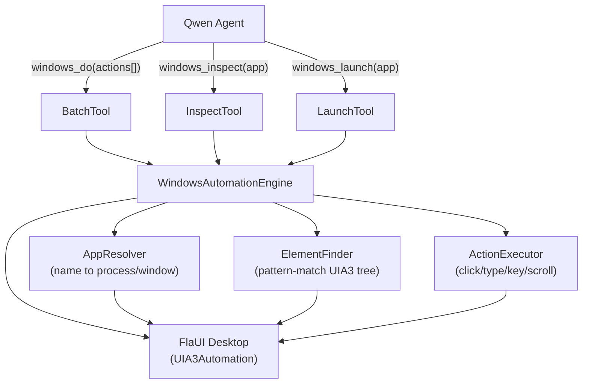
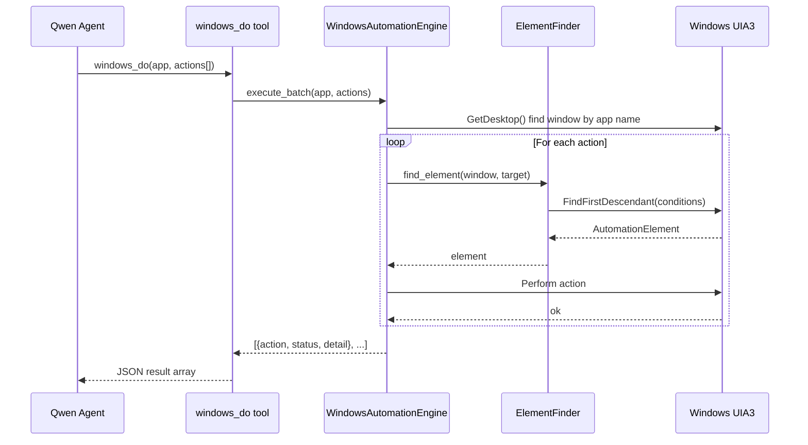
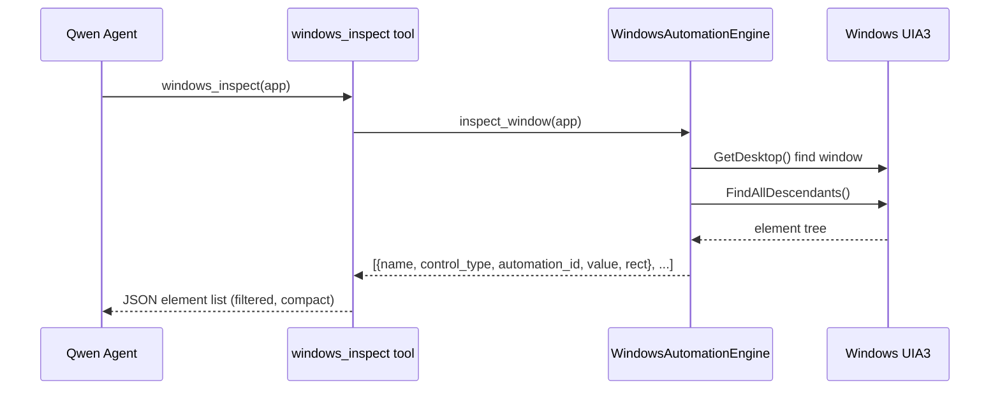

# Design Document: Windows Automation Tools

## Overview

A general-purpose Windows UI automation engine built on FlaUI/UIA3, exposed to the Qwen agent as 3 tools. The agent submits a JSON action batch describing what to do; the engine resolves windows, finds elements via pattern-matching, executes every action in sequence, and returns a structured result — all in a single tool call.

The design replaces the existing step-by-step `start_app_session / inspect_ui_elements / get_element_details / stop_app_session` flow (and removes the Appium/browser-use stack entirely) with a batch-first model that keeps agent context small and tool-call count low. Screen content is read via the UIA3 accessibility tree rather than screenshots, keeping responses fast.

---

## Architecture



---

## Sequence Diagrams

### Batch Execution Flow



### Inspect Flow



---

## Components and Interfaces

### WindowsAutomationEngine

Central singleton that owns the `UIA3Automation` instance and coordinates all sub-components.

```python
class WindowsAutomationEngine:
    def launch_app(self, app: str, args: str = "") -> dict
    def inspect_window(self, app: str, depth: int = 4) -> list[dict]
    def execute_batch(self, app: str, actions: list[dict]) -> list[dict]
    def close_app(self, app: str) -> dict
    def get_desktop_windows(self) -> list[dict]
```

### AppResolver

Resolves a human-readable app name to a live FlaUI Window element using multiple fallback strategies.

```python
class AppResolver:
    KNOWN_APPS = {
        "chrome":   {"exe": "chrome.exe",         "title_hint": "Chrome"},
        "excel":    {"exe": "EXCEL.EXE",           "title_hint": "Excel"},
        "word":     {"exe": "WINWORD.EXE",         "title_hint": "Word"},
        "explorer": {"exe": "explorer.exe",        "title_hint": ""},
        "whatsapp": {"exe": "WhatsApp.exe",        "title_hint": "WhatsApp"},
        "cmd":      {"exe": "cmd.exe",             "title_hint": ""},
        "settings": {"exe": "SystemSettings.exe",  "title_hint": "Settings"},
    }

    def resolve(self, app: str) -> AutomationElement | None
    # Strategy 1: exact title match via ByName
    # Strategy 2: title contains app name (case-insensitive scan of desktop children)
    # Strategy 3: process name match via psutil, then find window by PID
    # Strategy 4: fuzzy title match (difflib ratio > 0.6)
```

### ElementFinder

Finds a UI element inside a window using a target descriptor dict. Tries multiple UIA3 conditions in priority order so the agent does not need exact automation IDs.

```python
class ElementFinder:
    def find(self, root: AutomationElement, target: dict) -> AutomationElement | None
    # target keys (any combination):
    #   name          -> ByName exact, then contains
    #   automation_id -> ByAutomationId
    #   control_type  -> ByControlType (Button, Edit, ComboBox, Document, ...)
    #   index         -> nth match among control_type results
    #   text_contains -> scan Edit/Document elements for value match
```

Resolution priority:
1. `automation_id` (most stable)
2. `name` exact match
3. `name` contains match (case-insensitive)
4. `control_type` + `index`
5. `text_contains` scan

### ActionExecutor

Executes a single action dict against a resolved element or the window/desktop directly.

```python
class ActionExecutor:
    def execute(
        self,
        action: dict,
        element: AutomationElement | None,
        window: AutomationElement,
        engine: WindowsAutomationEngine
    ) -> dict
```

Supported action types:

| action         | Required fields               | Notes                              |
|----------------|-------------------------------|------------------------------------|
| click          | target                        | Left-click center of element       |
| double_click   | target                        | Double-click                       |
| right_click    | target                        | Opens context menu                 |
| type           | target, text                  | Clear then type (or append)        |
| key            | keys                          | e.g. "ctrl+c", "alt+F4"           |
| scroll         | target, direction, amount     | up/down/left/right, N ticks        |
| focus          | target                        | Set keyboard focus                 |
| read           | target                        | Return single element value/text   |
| read_screen    | —                             | Return all visible text in window  |
| wait           | ms                            | Sleep N milliseconds               |
| screenshot     | —                             | Capture current screen to file     |
| close_app      | —                             | Close window (explicit only)       |

---

## Data Models

### Action (input to windows_do)

```python
{
    "action": str,            # required — one of the action types above
    "target": {               # optional — omit for key/wait/screenshot/close_app
        "name": str,          # element name, partial match accepted
        "automation_id": str,
        "control_type": str,  # "Button" | "Edit" | "ComboBox" | "Document" | ...
        "index": int,         # 0-based, used with control_type
        "text_contains": str
    },
    "text": str,              # for type action
    "keys": str,              # for key action, e.g. "ctrl+shift+esc"
    "direction": str,         # for scroll: "up" | "down" | "left" | "right"
    "amount": int,            # for scroll: number of ticks (default 3)
    "ms": int,                # for wait
    "append": bool            # for type: if true, do not clear first
}
```

`read_screen` requires no target — it walks all descendants of the window and concatenates the `Name` and text-pattern values of every visible element into a single string. This is the preferred way for the agent to read window content without taking a screenshot.
```

### ActionResult (output from windows_do)

```python
{
    "action": str,
    "target": str | None,     # resolved element name or None
    "status": "ok" | "error" | "skipped",
    "detail": str,            # human-readable outcome or error message
    "value": str | None       # populated for read and screenshot actions
}
```

### InspectElement (output from windows_inspect)

```python
{
    "name": str,
    "automation_id": str,
    "control_type": str,
    "value": str,             # current text/value if readable
    "rect": {"x": int, "y": int, "w": int, "h": int},
    "depth": int
}
```

---

## Key Functions with Formal Specifications

### execute_batch(app, actions)

**Preconditions:**
- `app` is a non-empty string
- `actions` is a non-empty list; each item contains at least `"action"` key

**Postconditions:**
- Returns a list of ActionResult dicts with length equal to input actions
- If window not found: all results have `status="error"` with descriptive message
- Actions execute in order; a failed action does not abort subsequent actions
- `close_app` action only executes if explicitly present in the batch

**Loop Invariants:**
- `results[i]` corresponds to `actions[i]` for all processed `i`
- Window reference remains valid across actions unless `close_app` executes

### find(root, target)

**Preconditions:**
- `root` is a valid AutomationElement
- `target` contains at least one non-null key

**Postconditions:**
- Returns first matching AutomationElement or None
- Resolution follows priority order: automation_id, exact name, contains name, type+index, text scan
- No mutations to the UI tree

### resolve(app)

**Preconditions:**
- `app` is a non-empty string

**Postconditions:**
- Returns a Window element or None
- Tries all 4 strategies before returning None
- Case-insensitive matching throughout

---

## Algorithmic Pseudocode

### Batch Execution

```pascal
ALGORITHM execute_batch(app, actions)
INPUT: app: String, actions: List[ActionDict]
OUTPUT: results: List[ActionResult]

BEGIN
  window <- AppResolver.resolve(app)

  IF window IS NULL THEN
    RETURN [Error("Window not found: " + app)] * len(actions)
  END IF

  results <- []

  FOR each action IN actions DO
    ASSERT len(results) = index_of(action)

    TRY
      IF action.action = "close_app" THEN
        window.Close()
        results.append(Ok("closed"))
        BREAK
      END IF

      element <- NULL
      IF action.target IS NOT NULL THEN
        element <- ElementFinder.find(window, action.target)
        IF element IS NULL THEN
          results.append(Error("Element not found: " + str(action.target)))
          CONTINUE
        END IF
      END IF

      result <- ActionExecutor.execute(action, element, window)
      results.append(result)

    CATCH e
      results.append(Error(str(e)))
    END TRY
  END FOR

  RETURN results
END
```

### Element Resolution

```pascal
ALGORITHM find(root, target)
INPUT: root: AutomationElement, target: TargetDict
OUTPUT: element: AutomationElement | NULL

BEGIN
  cf <- ConditionFactory(UIA3PropertyLibrary())

  IF target.automation_id IS NOT NULL THEN
    el <- root.FindFirstDescendant(cf.ByAutomationId(target.automation_id))
    IF el IS NOT NULL THEN RETURN el END IF
  END IF

  IF target.name IS NOT NULL THEN
    el <- root.FindFirstDescendant(cf.ByName(target.name))
    IF el IS NOT NULL THEN RETURN el END IF
  END IF

  IF target.name IS NOT NULL THEN
    all <- root.FindAllDescendants()
    FOR each el IN all DO
      IF el.Name.lower() CONTAINS target.name.lower() THEN
        RETURN el
      END IF
    END FOR
  END IF

  IF target.control_type IS NOT NULL THEN
    ct <- ControlType[target.control_type]
    matches <- root.FindAllDescendants(cf.ByControlType(ct))
    idx <- target.index OR 0
    IF idx < len(matches) THEN RETURN matches[idx] END IF
  END IF

  IF target.text_contains IS NOT NULL THEN
    edits <- root.FindAllDescendants(cf.ByControlType(ControlType.Edit))
    FOR each el IN edits DO
      IF el.AsTextBox().Text CONTAINS target.text_contains THEN
        RETURN el
      END IF
    END FOR
  END IF

  RETURN NULL
END
```

### App Resolution

```pascal
ALGORITHM resolve(app)
INPUT: app: String
OUTPUT: window: AutomationElement | NULL

BEGIN
  desktop <- automation.GetDesktop()
  cf <- ConditionFactory(UIA3PropertyLibrary())
  app_lower <- app.lower()

  -- Strategy 1: exact title
  win <- desktop.FindFirstDescendant(cf.ByName(app))
  IF win IS NOT NULL THEN RETURN win END IF

  -- Strategy 2: title contains (scan all top-level windows)
  children <- desktop.FindAllChildren()
  FOR each child IN children DO
    IF child.Name.lower() CONTAINS app_lower THEN
      RETURN child
    END IF
    hint <- KNOWN_APPS[app_lower].title_hint
    IF hint != "" AND child.Name.lower() CONTAINS hint.lower() THEN
      RETURN child
    END IF
  END FOR

  -- Strategy 3: process name match via psutil
  exe <- KNOWN_APPS[app_lower].exe OR (app + ".exe")
  FOR each proc IN psutil.process_iter() DO
    IF proc.name().lower() = exe.lower() THEN
      pid <- proc.pid
      FOR each child IN children DO
        IF get_pid(child) = pid THEN RETURN child END IF
      END FOR
    END IF
  END FOR

  -- Strategy 4: fuzzy title match
  best_ratio <- 0
  best_win <- NULL
  FOR each child IN children DO
    ratio <- difflib.SequenceMatcher(app_lower, child.Name.lower()).ratio()
    IF ratio > 0.6 AND ratio > best_ratio THEN
      best_ratio <- ratio
      best_win <- child
    END IF
  END FOR
  IF best_win IS NOT NULL THEN RETURN best_win END IF

  RETURN NULL
END
```

---

## Agent-Facing Tools (Qwen Tool Interface)

Three tools total. The agent uses `windows_launch` to open apps, `windows_inspect` to discover UI elements when needed, and `windows_do` for all actual interaction.

### Tool 1: windows_launch

Launches a Windows application by name or executable. Does not close it — closing must be done via `windows_do` with `close_app` action.

Parameters:
- `app` (string, required): App name e.g. "chrome", "excel", "cmd"
- `args` (string, optional): Command-line arguments

Returns: `{"status": "launched"|"already_running"|"error", "window_title": str, "detail": str}`

### Tool 2: windows_inspect

Returns a compact element tree for a running application window. Use this when you need to discover element names or automation IDs before building an action batch.

Parameters:
- `app` (string, required): App name e.g. "chrome", "excel"
- `depth` (int, optional, default 4): How deep to traverse the tree
- `filter_types` (string, optional): Comma-separated control types to include e.g. "Button,Edit,ComboBox"

Returns: JSON array of InspectElement objects

### Tool 3: windows_do

Execute a batch of UI actions against a running application. This is the primary interaction tool.

Parameters:
- `app` (string, required): Target application name
- `actions` (array, required): List of action dicts (see Data Models above)

Returns: JSON array of ActionResult objects, one per action

---

## Error Handling

### Window Not Found

**Condition**: `AppResolver.resolve()` returns None after all 4 strategies
**Response**: Return error results for all actions with message "Window not found for: {app}. Use windows_launch first or check the app is running."
**Recovery**: Agent should call `windows_launch` then retry

### Element Not Found

**Condition**: `ElementFinder.find()` returns None
**Response**: Single action result with `status="error"`, detail includes the target descriptor
**Recovery**: Batch continues with next action; agent can call `windows_inspect` to discover correct element names

### Action Execution Error

**Condition**: FlaUI throws during click/type/key/scroll
**Response**: Catch exception, return `status="error"` with exception message; continue batch
**Recovery**: Agent retries with corrected target or different action

### App Launch Failure

**Condition**: subprocess.Popen fails or window does not appear within timeout
**Response**: `{"status": "error", "detail": "..."}` from `windows_launch`
**Recovery**: Agent reports failure to user

---

## Testing Strategy

### Unit Testing Approach

Test each component in isolation using mock AutomationElement objects:
- `AppResolver.resolve()` with mocked desktop children
- `ElementFinder.find()` with mocked element trees covering all 5 strategies
- `ActionExecutor.execute()` for each action type with mock elements

### Property-Based Testing Approach

**Property Test Library**: hypothesis

Key properties:
- `find(root, target)` never raises an exception for any valid target dict
- `execute_batch` result length always equals input actions length
- `resolve(app)` returns None or a valid element (never raises)
- Any action with a missing required field returns `status="error"` not an exception

### Integration Testing Approach

Manual smoke tests against real Windows apps (Notepad as baseline since it's always available):
- Launch Notepad, type text, read it back, close
- Verify `windows_inspect` returns at least one Edit element for Notepad
- Verify key combos (ctrl+a, ctrl+c) work correctly

---

## Performance Considerations

- `FindAllDescendants()` on a large app (Chrome, Excel) can be slow (200–800ms). `windows_inspect` should cap depth at 4 by default and support `filter_types` to reduce tree size.
- `ElementFinder` should short-circuit on first successful strategy rather than always scanning all descendants.
- The `UIA3Automation` instance is a singleton — creating it per call is expensive. Engine holds it for the process lifetime.
- For `windows_inspect` on large apps, limit results to 200 elements max and sort by depth to keep the most useful elements first.

---

## Security Considerations

- The engine runs with the same privileges as the agent server process. No privilege escalation is performed.
- `windows_launch` uses `subprocess.Popen` — only allow known app names or validated executable paths to prevent arbitrary code execution via the agent.
- `type` action input is passed directly to the UI element; the agent server should not expose this tool to untrusted external callers.

---

## agent.py Cleanup

The following are removed entirely from `agent.py`:

| Removed item | Reason |
|---|---|
| `from browser_use import ...` | Replaced by FlaUI |
| `from browser_use.browser.service import Browser` | Replaced by FlaUI |
| `from langchain_openai import ChatOpenAI` | Only used by BrowserAgent |
| `import win` | win.py session management replaced by flaui.py engine |
| `ChromeBrowser` class | Replaced by FlaUI |
| `BrowserAutomationTool` (`browser_automation`) | Replaced by `windows_do` |
| `SearchWinAppByName`, `StartAppSession`, `InspectUIElements`, `ListElementNames`, `GetElementDetails`, `StopAppSession` | Replaced by 3 new tools |
| `ACTIVE_SESSIONS` dict | Session state now managed inside `WindowsAutomationEngine` |

Everything else (mem0, FastAPI routes, audio, file upload) is preserved unchanged.

---

## Dependencies

- `pythonnet` (clr) — already in use
- `FlaUI.Core.dll`, `FlaUI.UIA3.dll` — already at `deps/flaui/`
- `psutil` — for process-name-based window resolution (Strategy 3)
- `difflib` — stdlib, for fuzzy title matching (Strategy 4)
- `pyautogui` or `keyboard` — for key combo execution (fallback when FlaUI keyboard API is insufficient)

Removed dependencies (no longer needed):
- `browser-use`, `playwright`, `playwright-stealth`
- `langchain-openai`
- `appium` / WinAppDriver (via `win.py`)
