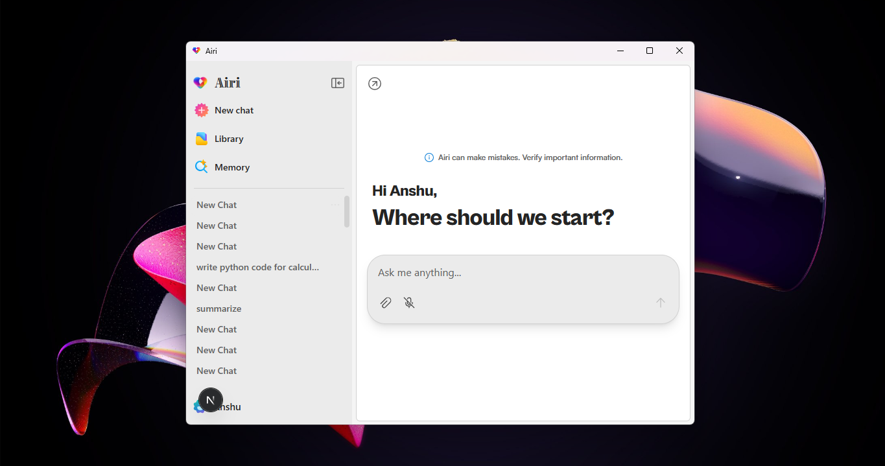
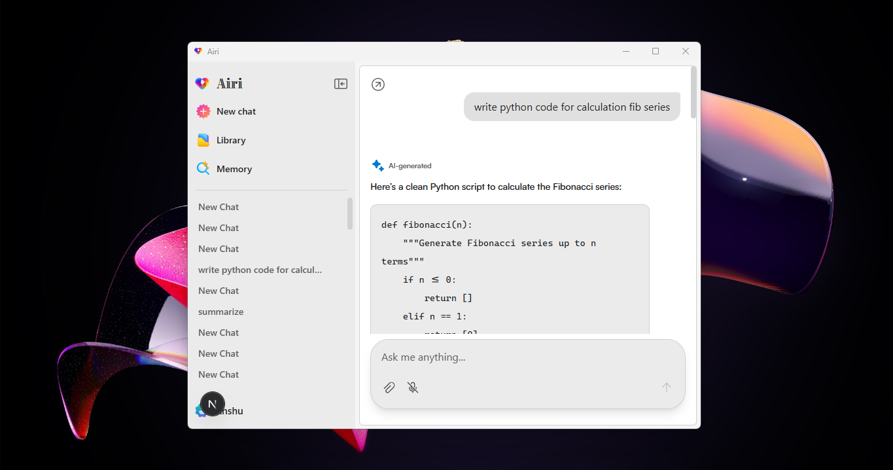
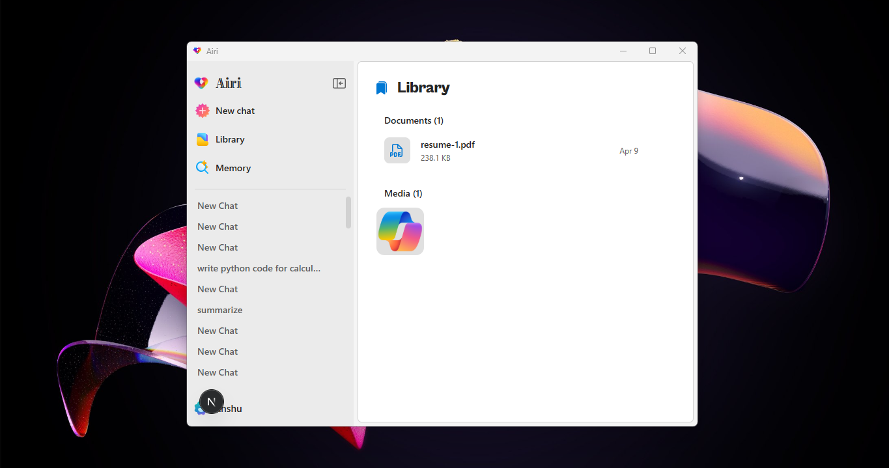
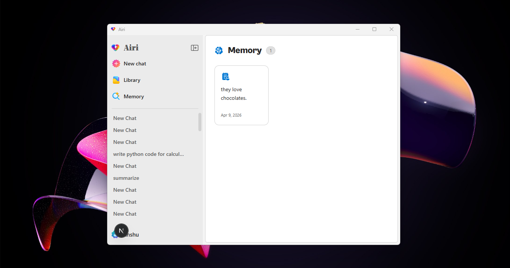

<div align="center">


# Airi

**Local-first AI desktop assistant for Windows**

Control your PC, automate apps, browse the web, and chat — all with natural language. Runs entirely on your machine.

[](LICENSE.txt)
[](https://github.com/varshney-ansh/airi/releases)
[](https://electronjs.org)
[](https://nextjs.org)
[](https://python.org)

[Download](#-download) · [Quick Start](#-quick-start) · [Features](#-features) · [Contributing](#-contributing)

</div>

---



<div align="center">
  
  
  
</div>

---

## ✨ Features

- **Natural language chat** — Streaming responses powered by Qwen3-VL-2B running locally
- **Windows automation** — Launch, inspect, and control any installed app via UI Automation
- **Browser automation** — Navigate sites, fill forms, extract data with Playwright
- **File management** — List, open, copy, move, search files with path aliases
- **Document & image analysis** — Upload PDFs, Word docs, images for instant RAG
- **Persistent memory** — Remembers preferences and facts across sessions (local Qdrant)
- **Thinking mode** — Qwen3's extended reasoning for complex multi-step tasks
- **Fully local** — No cloud, no API keys required, nothing leaves your machine
- **Remote LLM support** — Optionally connect to OpenAI, Ollama, or any OpenAI-compatible API

---

## 🛠 Tech Stack

| Layer | Tech |
|---|---|
| Desktop shell | Electron 40 |
| Frontend | Next.js 16, React 19, Tailwind CSS v4 |
| UI | Fluent UI, ShadCN, Framer Motion |
| Agent backend | Python, FastAPI, Qwen-Agent |
| LLM inference | llama.cpp (`llama-server`) |
| Vision model | Qwen3-VL-2B-Instruct |
| Embeddings | embeddinggemma-300m |
| Browser automation | Playwright |
| Windows automation | FlaUI (UIA3) |
| Vector DB | Qdrant (local) |
| Memory | mem0 (local) |
| Auth | Auth0 |
| Database | MongoDB Atlas + local electron-store |

---

## 📦 Download

Grab the latest installer from [Releases](https://github.com/varshney-ansh/airi/releases):

```
Airi-Setup-0.1.0.exe   (~574 MB, includes llama.cpp + all deps)
```

Silent install (for scripting / Microsoft Store):
```
Airi-Setup-0.1.0.exe /VERYSILENT /SUPPRESSMSGBOXES /NORESTART
```

---

## 🚀 Quick Start

### Prerequisites

- Windows 10 (1809+) or Windows 11, x64
- Node.js v18+
- Python 3.10+
- Git

### 1. Clone

```bash
git clone https://github.com/varshney-ansh/airi.git
cd airi
```

### 2. Environment

```bash
cp .env.example .env.local
# Fill in your Auth0 and MongoDB credentials
```

### 3. Install dependencies

```bash
npm install

python -m venv .venv
.venv\Scripts\activate
pip install -r requirements.txt
playwright install chromium
```

### 4. Start the LLM server

```bash
# llama.cpp binaries are included in deps/llama-cpp/
deps\llama-cpp\llama-server.exe ^
  -hf Qwen/Qwen3-VL-2B-Instruct-GGUF:Q4_K_M ^
  --port 11434 --ctx-size 32768 --jinja
```

> Models are cached to `models/` on first run. Swap for any OpenAI-compatible GGUF.

### 5. Run

```bash
.venv\Scripts\activate
npm run dev
```

The app opens automatically. The Next.js dev server runs on `http://localhost:3000`.

---

## 📁 Project Structure

```
airi/
├── agent-server/
│   ├── agent.py          # FastAPI server + Qwen-Agent + all tools
│   ├── flaui.py          # FlaUI Windows automation engine
│   ├── win.py            # Windows utility helpers
│   └── agent.spec        # PyInstaller spec for bundling
├── electron/
│   ├── main.js           # Electron entry — spawns llama-server, agent, searxng
│   ├── preload.js        # Context bridge
│   └── model-download.js # Auto model download on first launch
├── src/
│   ├── app/              # Next.js app router pages
│   │   ├── page.jsx      # Main chat dashboard
│   │   ├── login/        # Auth0 login + onboarding
│   │   └── library/      # Chat history library
│   ├── component/        # App-specific components
│   │   ├── chatMain/     # Chat interface + agent loader
│   │   ├── chatInput/    # Input bar with file upload
│   │   ├── chatItem/     # Message bubbles
│   │   └── appsidebar.jsx
│   ├── context/          # React context (ChatContext)
│   └── lib/              # Auth0, avatar, API helpers
├── ui-components/        # Reusable design system components
├── installer/
│   ├── airi-installer.iss  # Inno Setup script
│   └── build-installer.bat
├── scripts/              # Build helper scripts
├── deps/
│   ├── llama-cpp/        # llama.cpp Windows binaries
│   └── flaui/            # FlaUI .NET assemblies
├── public/               # Icons, fonts
├── requirements.txt      # Python dependencies
└── package.json
```

---

## 🧰 Agent Tools

The agent (`agent-server/agent.py`) exposes these tools to the LLM:

| Tool | Description |
|---|---|
| `windows_launch` | Launch any installed Windows app |
| `windows_inspect` | Get UI element tree of a running app |
| `windows_do` | Execute batch UI actions (click, type, scroll, etc.) |
| `file_op` | File system operations (list, open, copy, move, delete, search) |
| `list_installed_apps` | Query the pre-built app index |
| `add_memory` | Save a fact to long-term memory |
| `search_memories` | Semantic search over stored memories |
| `get_memories` | Retrieve all memories for the current user |
| `browser_*` | Playwright browser automation tools |
| `web_search` | SearXNG-powered web search |

---

## ⚙️ Configuration

### LLM Settings

Edit `agent-server/settings.json` (created on first run) or use the in-app Settings panel:

```json
{
  "model_server": "http://127.0.0.1:11434/v1",
  "model": "default",
  "api_key": "none",
  "thinking_enabled": true,
  "theme": "Night"
}
```

To use a remote API (OpenAI, Ollama, etc.), set `model_server` to the remote URL — the local llama-server will not start.

### Memory

Memories are stored locally in `%APPDATA%\Airi\.mem0_db` (Qdrant). Nothing is sent to the cloud.

---

## 🏗 Building

### Development build
```bash
npm run dev
```

### Production Electron build
```bash
npm run build:electron
```

### Inno Setup installer (requires [Inno Setup 6](https://jrsoftware.org/isdl.php))
```bash
npm run build:inno
# or
installer\build-installer.bat
```

### Bundle Python agent
```bash
cd agent-server
pyinstaller agent.spec
```

---

## 🤝 Contributing

Contributions are welcome! Please read [CONTRIBUTING.md](CONTRIBUTING.md) first.

1. Fork the repo and create a branch: `git checkout -b feat/your-feature`
2. Make your changes and test with `npm run dev`
3. Follow [Conventional Commits](https://www.conventionalcommits.org/): `git commit -m "feat: add X"`
4. Open a Pull Request against `main`

For bugs, open an [issue](https://github.com/varshney-ansh/airi/issues) with steps to reproduce.

---

## 📄 License

[MIT](LICENSE.txt) — © 2026 Slew Inc.
